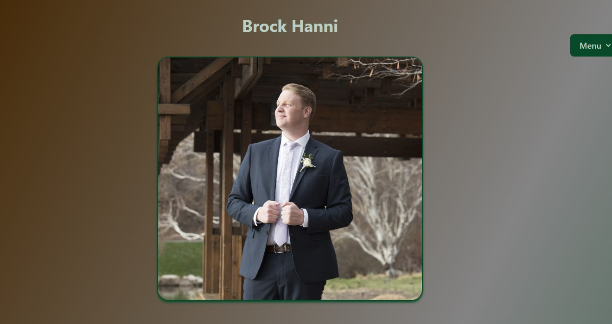
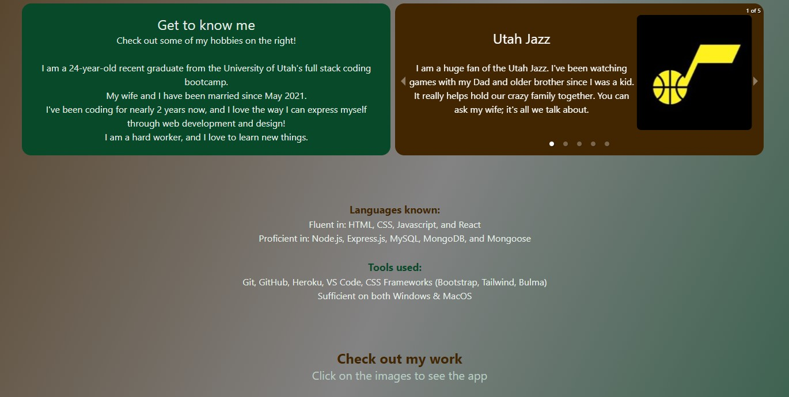
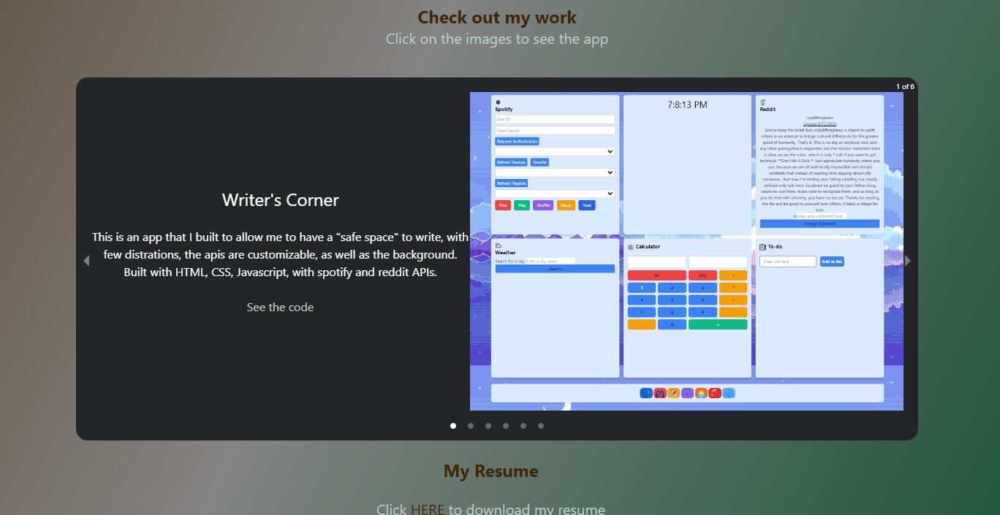
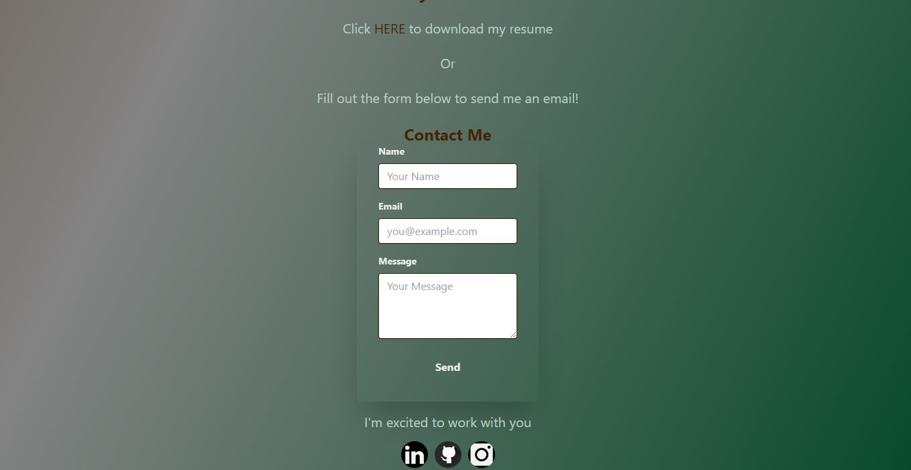

# Hanni-Portfolio-React

This is my new Portfolio showing off my past products, built using React and tailwind

## Installation

Run npm i

## Usage

Run npm start, and my portfolio will show up

## Contributing/Contact

To submit bug reports, feature requests, or pull requests, please email me at Hannibr26@gmail.com, or visit my GitHub page: BrockHanni(https://github.com/BrockHanni)

## Deployment

https://brockhanni.github.io/HanniPortfolio-React/

## Screenshots

## Table of Contents
- [Installation](#installation)
- [Usage](#usage)
- [Contributing/Contact](#contributing/Contact)
- [Deployment](#deployment)
- [Screenshots](#screenshots)
- [Table of Contents](#table-of-contents)
